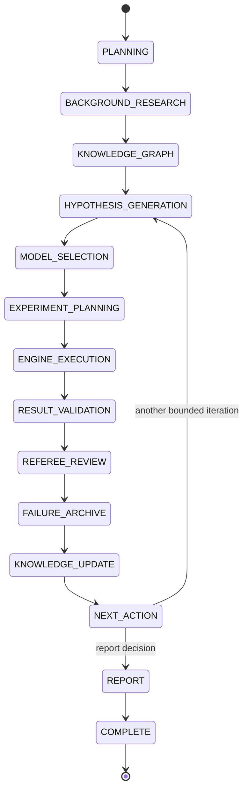

# Campaign State Machine

Scientific phase and operational status are separate. A pause never pretends that scientific work advanced, and a failure never rewrites the phase where it happened.

The normal path is single-step and forward-only. `NEXT_ACTION` is the only branching phase: a trusted caller explicitly selects another bounded hypothesis cycle or reporting. The runtime does not choose the branch.

## Operational status

| Current status | Operation | Next status | Phase change |
| --- | --- | --- | --- |
| `ACTIVE` | pause | `PAUSED` | none |
| `PAUSED` | resume | `ACTIVE` | none |
| `ACTIVE`, `PAUSED`, or `FAILED` | cancel | `CANCELLED` | none |
| `ACTIVE` | fail safely | `FAILED` | none |
| `FAILED` | retry | `ACTIVE` | none |
| `ACTIVE` + phase `REPORT` | transition to `COMPLETE` | `COMPLETE` | `COMPLETE` |

`CANCELLED` and `COMPLETE` are terminal for normal runtime controls. Rollback is rejected for cancelled campaigns. A checkpoint may be created while paused so an operator can preserve a diagnostic state.

## Transition guarantees

`validate_transition(source, target)` checks the complete phase-pair table. An illegal edge raises `IllegalCampaignTransition` before revision, budget, timeline, or disk state changes. Each accepted scientific transition:

1. verifies active status and remaining iteration budget;
2. increments phase, iteration, budget use, transition count, and revision;
3. appends a typed timeline event;
4. builds and verifies a hashed iteration checkpoint inside the aggregate;
5. atomically saves the transition and referenced checkpoint together with the prior revision as compare-and-swap input.

The Python suite contains one discovered test for every 14×14 source/target pair, in addition to end-to-end lifecycle, pause/resume, cancel, retry, rollback, persistence, and concurrency tests.

## Rollback semantics

Rollback is not a reverse transition. It is a trusted recovery operation:

- checkpoint hashes are verified first;
- state and graph snapshots are restored together;
- the current revision advances, preventing an ABA/stale-write condition;
- checkpoints and post-checkpoint timeline history are retained;
- a rollback event and a new recovery checkpoint are appended.

This makes recovery auditable while preserving deterministic phase validation for ordinary execution.
