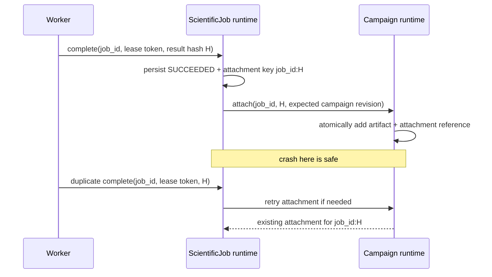

# Exactly-Once Logical Result Attachment

Mystic's contract is deliberately two-layered:

1. Engine execution is **at least once**. A lost response may cause the trusted worker to retry or a lease to be reclaimed and run again.
2. Campaign mutation is **logically exactly once**. The same accepted job result can affect the campaign aggregate only one time.

## Stable identity

On first accepted completion, the runtime stores:

- `job_id`
- canonical `result_hash`
- `attachment_key = scientific-job:<job_id>:<result_hash>`
- the campaign revision created with the execution intent

`CampaignRuntime.attach_scientific_job_result` treats an existing attachment with exactly the same job ID, hash, and attachment key as a successful replay. It creates a result artifact and increments the campaign revision only on the first accepted attachment.

## Replay and conflict rules

| Case | Result |
| --- | --- |
| Same current/completed lease token, same result hash | Replay is ignored and audited; attachment is retried if incomplete. |
| Same job/token, different result hash | Conflict is rejected, counter/audit event is recorded, and campaign is unchanged. |
| Stale/expired/replaced token | Rejected before mutation. |
| Job result after cancellation | Job becomes/stays cancelled; result is not attached. |
| Campaign revision changed or rollback removed its reference | Attachment is marked rejected on the job; campaign is unchanged. |
| Existing campaign attachment with different hash/key | Conflict is rejected and remains auditable. |

The job record retains accepted result provenance even when campaign attachment is rejected. This preserves post-mortem evidence without allowing a superseded campaign revision to be mutated.

## Transaction boundaries

Local job persistence and local campaign persistence are separate durable aggregates, so they cannot be one filesystem transaction. The durable pending attachment record closes that gap: recovery repeats the campaign operation with the same stable identity until it observes `ATTACHED` or a fail-closed rejection.

Supabase has a transactional `mystic_attach_scientific_job_result` RPC that locks the job and campaign, verifies revision/reference compatibility, and uses a unique job attachment row. It may replay an existing matching attachment but cannot insert a second logical attachment for the same job. If campaign rollback later removes the matching campaign attachment reference, the historical job attachment remains auditable but a replay is rejected rather than re-applied.
