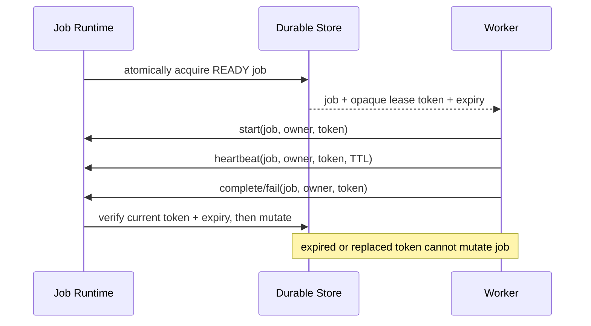

# Scientific Job Leasing

Leases make one worker the current authorized executor without assuming that the external engine itself executes only once.

## Acquire

Acquisition is a compare-and-swap operation under the local aggregate lock. Supabase uses `FOR UPDATE SKIP LOCKED` inside `mystic_acquire_scientific_job_lease`. The operation requires `READY`, `ready_at <= now`, a remaining attempt, and no cancellation request. It increments `attempt`, creates one lease-history entry, and stores only `SHA-256(lease_token)`.

## Start and heartbeat

`start` and `heartbeat` require the exact worker identity and current opaque token. They reject a changed owner, bad token, inactive state, cancellation intent, or expiry. The internal `ScientificJobWorker` renews during engine execution at a bounded interval (at most half the lease TTL); a worker that cannot renew stops cooperatively instead of attempting a stale completion. Heartbeat moves the expiry forward only within the configured 10–300 second TTL bounds and records the renewal in lease history.

## Expire and reclaim

The reconciler treats an expired `LEASED` or `RUNNING` job as abandoned. It releases the historical lease and moves the job to `RETRY_WAIT`, `DEAD_LETTER`, or `CANCELLED` according to cancellation state and retry budget. A stale worker has no remaining capability: start, heartbeat, complete, and fail all fail closed.

## Complete and fail

Only a current, unexpired `RUNNING` holder can persist a result or failure. Completion validates job identity, result structure/size/hash, engine ID/version, and token proof before changing state. Failure persists an explicit failure class and retryability. A duplicate completion with the same completed token and hash is recorded as a replay and ignored; a different result is rejected and audited.

No lease token or token hash appears in public MCP or Control Center payloads. The internal worker facade is not registered as an MCP tool.
