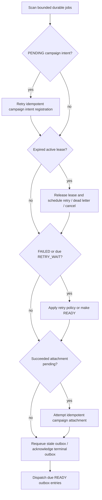

# Scientific Job Reconciliation and Outbox

Reconciliation is deterministic, bounded, and idempotent. It can run after every process restart and repeatedly while the runtime is already correct.

## Durable outbox

Local job creation persists the `ScientificJob` and its `ScientificJobOutboxEvent` in the same atomic aggregate write. If the process crashes after that write and before campaign-intent confirmation or worker notification, the job remains `PENDING` and reconciliation completes its idempotent intent registration.

The Supabase `mystic_create_scientific_job` RPC creates the job, campaign reference, and outbox event in one transaction. `mystic_dispatch_scientific_job_outbox` atomically marks due entries `DISPATCHED` before handing them to a replaceable transport. A poller is the initial transport: it can rediscover `READY` work without a broker. If notification is interrupted, a stale dispatched event becomes `PENDING` again. Once a lease is acquired, dispatched events are acknowledged. Terminal jobs' events are acknowledged without executing them.

## Recovery matrix

| Interruption | Durable fact | Deterministic recovery |
| --- | --- | --- |
| After job/outbox persistence | `PENDING` job exists | Register campaign intent once; then make `READY`. |
| After lease acquisition | `LEASED` token hash/history exists | Expiry reclaims it; stale holder is rejected. |
| During execution | `RUNNING` with lease expiry | Retry wait, dead letter, or cancellation after expiry. |
| After result persistence | `SUCCEEDED` with pending attachment | Retry idempotent campaign attachment. |
| After campaign attachment | Campaign has stable attachment key | Replay returns existing attachment and marks job attached. |
| Before worker receives response | Job has durable accepted result/failure | Same-token replay is ignored; conflict fails closed. |

The local reconciler reports scanned jobs, recovered intents/leases, retry scheduling/release, stale outbox requeues, terminal acknowledgements, attachment outcomes, and dispatch outcomes. `lab_job_statistics` derives state counts, average attempts, replay/conflict counters, and reconciliation counters from durable job records.

For Supabase, the service-role reconciliation RPC repairs leases, retry state, outbox state, pending result attachments, and dead-letter failure attachments in the same bounded pass. It calls the idempotent attachment RPCs only with each persisted job's expected campaign revision; a conflict becomes a durable rejection rather than a campaign mutation. Neither worker/reconciler RPC is public MCP surface.
