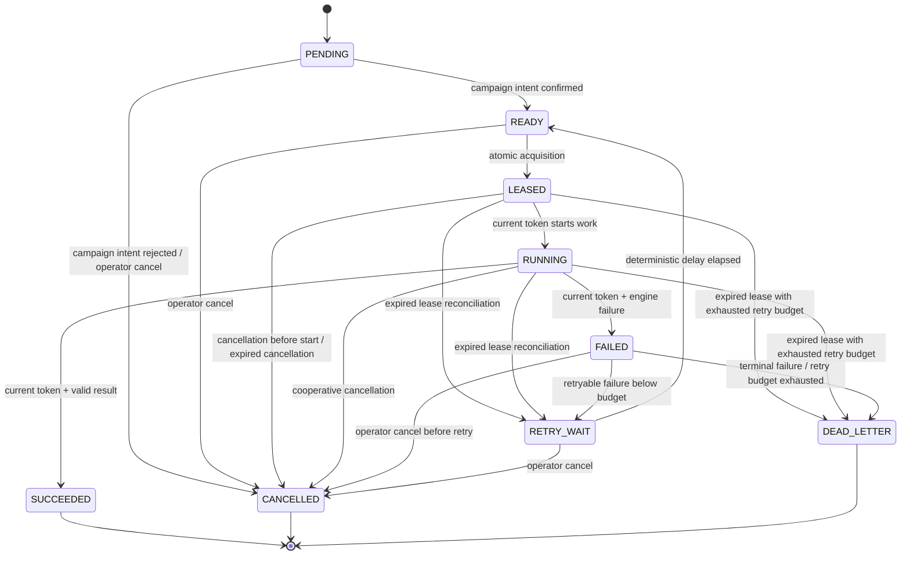

# Scientific Job State Machine

Every `ScientificJob` transition is explicit, validated before persistence, revisioned, and audited. An illegal edge raises `IllegalScientificJobTransition`; no partial state or campaign mutation is written.

| State | Meaning | Executable? |
| --- | --- | --- |
| `PENDING` | Job and outbox intent are durable; campaign intent recovery is incomplete. | No |
| `READY` | Campaign intent is confirmed and a worker may acquire it. | Yes |
| `LEASED` | Exactly one holder has an unexpired opaque capability. | Holder only |
| `RUNNING` | The proven holder has started cooperative engine work. | Holder only |
| `SUCCEEDED` | Result is durable; campaign attachment is pending, attached, or rejected. | No |
| `FAILED` | A worker reported a validated failure; retry policy has not yet run. | No |
| `RETRY_WAIT` | Deterministic exponential delay has been scheduled. | No |
| `CANCELLED` | Cancellation was accepted or cooperatively observed. | No |
| `DEAD_LETTER` | No automatic retry remains; terminal failure can be archived. | No |

`PENDING`, `READY`, `RETRY_WAIT`, and `FAILED` can be cancelled idempotently. Cancelling `LEASED` or `RUNNING` records cancellation intent; an engine that cannot be interrupted may still consume work, but its holder cannot attach a result after cancellation. `SUCCEEDED` and `DEAD_LETTER` cannot silently become cancelled or executable again.

Retries never reset `attempt` and never exceed `max_attempts`. `DEAD_LETTER` jobs are never redispatched automatically.

## Failure classification and retry policy

| Failure class | Default retry posture |
| --- | --- |
| `VALIDATION`, `ENGINE_PERMANENT`, `CAMPAIGN_STALE`, `RESULT_CONFLICT`, `CANCELLED` | Terminal / no retry. |
| `ENGINE_TRANSIENT`, `DISPATCH` | Retry only when the trusted adapter records `retryable=true` and attempts remain. |
| `LEASE_EXPIRED` | Reconciler retries only when cancellation was not requested and attempts remain. |
| `INTERNAL` | Explicitly classified by the trusted adapter; it is never retried indefinitely. |

The delay is deterministic bounded exponential backoff: `min(retry_base_seconds * 2^(attempt - 1), retry_max_seconds)`. The default runtime policy is 5 seconds base, 3,600 seconds maximum, and at most 10 attempts per job (3 by default).
