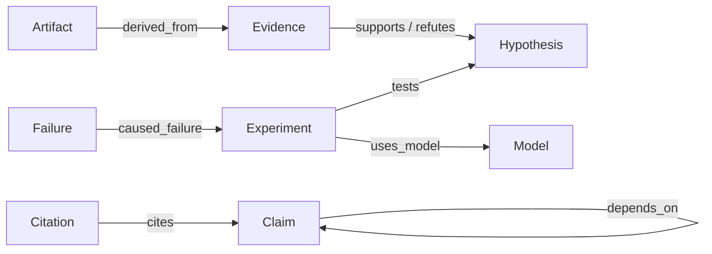

# Campaign Knowledge Graph

`CampaignGraph` is Mystic's Phase 2C.1 graph-database abstraction. The local backend serializes it inside the atomic campaign aggregate. The cloud backend stores nodes, edges, and checkpoints in dedicated Supabase tables. The API is storage-neutral.

## Node model

Supported node types are:

- `claim`
- `evidence`
- `model`
- `hypothesis`
- `experiment`
- `failure`
- `citation`
- `artifact`

Every node has a stable `node_id`, a positive version, an optional `supersedes_version`, a typed JSON payload, creation time, and a canonical SHA-256 content hash. Updating a node appends version `n + 1`; it never overwrites version `n`. Read clients may request latest versions only or the full history.

## Edge model

Supported relationships are `supports`, `refutes`, `uses_model`, `tests`, `cites`, `depends_on`, `caused_failure`, `supersedes`, and `derived_from`.

Both endpoints must exist before an edge is accepted. Self-edges fail except for an explicit `supersedes` relationship. Graph node and edge budgets are checked before mutation.

## Integrity and checkpoints

The graph hash covers every node version and edge in canonical key order. A checkpoint stores the graph snapshot separately from campaign state and records hashes for graph, state, and checkpoint metadata. Loading or rolling back a checkpoint recomputes these hashes and rejects mismatches.

Hashes detect corruption or tampering; they are not an authorization or confidentiality mechanism. Existing MCP OAuth and Control Center session boundaries remain responsible for access control.

## Data rules

- Graph payloads must contain scientific records, safe citations, and opaque references—not credentials, environment values, host paths, private topology, or hidden reasoning.
- Engine output becomes evidence only after an explicit record links it; computed output is not automatically a verified conclusion.
- Citations are versioned nodes so changes in bibliographic metadata remain auditable.
- Dependencies are explicit edges rather than implicit ordering inferred by an AI model.
