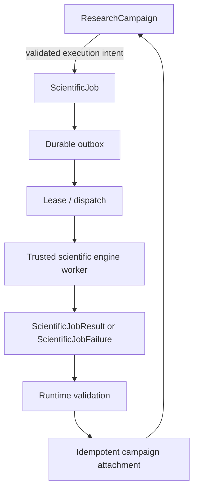

# Durable Scientific Job Runtime (Phase 2C.2A)

Phase 2C.2A is Mystic LAB's deterministic execution substrate. It is deliberately not an agent framework and contains no autonomous LLM decisions. A `ResearchCampaign` records a validated execution intent; a `ScientificJob` owns all worker-facing state; only the job runtime calls the campaign runtime to apply a result.

## Execution guarantee

Mystic does **not** guarantee exactly-once physical engine execution. A worker can run more than once after a crash, timeout, lease loss, or delivery retry. Mystic guarantees that an accepted result is applied to campaign state **logically exactly once**. The attachment key is derived from `job_id` and the canonical `result_hash`, and both the job runtime and campaign runtime reject conflicting values.

## Durable model

`ScientificJob` is a versioned (`2C.2A`) aggregate persisted as a single atomic local JSON document together with its outbox, lease history, attachment state, and bounded audit events. It contains the campaign and campaign revision, allowlisted engine/version, validated JSON input and hash, state, attempt budget, lease proof hash, result/failure data, idempotency/correlation identifiers, schema/revision numbers, and timestamps.

Persisted `ScientificJobResult`, `ScientificJobFailure`, `ScientificJobLease`, `ScientificJobOutboxEvent`, and audit events are likewise versioned and strictly decoded. Unknown fields, malformed timestamps, unsafe JSON values, bad hashes, duplicate active leases, and invalid aggregate invariants are rejected; arbitrary Python objects are never serialized.

The local store is `mystic_data/scientific_jobs/<job_id>/job.json`. It uses an advisory file lock, optimistic revision checks, fsync, and atomic replacement. This is independent of the older Phase 2A in-memory engine queue and does not alter it.

The additive Supabase migration `20260807010000_durable_scientific_job_runtime_phase2c2a.sql` adds job, lease, outbox, attachment, and audit-event tables plus service-role RPCs. It enables Supabase's standard `pgcrypto` extension in its `extensions` schema so opaque lease-token and canonical JSON payload hashes can be verified inside RPCs. It is never applied automatically.

## Engine adapter contract

`ScientificEngineJobAdapter` is engine-agnostic over the existing server-owned `EngineRegistry`:

- `ScientificJobRequest` captures normalized, validated engine input and its hash.
- `ScientificJobExecution` captures the worker/job/attempt execution boundary.
- `ScientificJobResult` captures structured, size-bounded output and provenance.
- `ScientificJobFailure` captures a safe error, explicit failure class, and retryability.

`ScientificJobResult.result_hash` is the canonical SHA-256 hash of its `result_payload`, not its outer provenance envelope. The Supabase completion RPC requires the complete, exact versioned result record and verifies that same payload hash before accepting it.

The adapter only resolves existing allowlisted engine IDs and validates the persisted input again before execution. It never interprets an engine name as a shell command, module name, or file path.

## Operator API and internal boundary

Public MCP/operator tools are limited to:

| Tool | Purpose |
| --- | --- |
| `lab_job_create` | Record one campaign-linked engine execution intent. |
| `lab_job_get` | Read a redacted job record. |
| `lab_job_list` | List bounded operator summaries. |
| `lab_job_cancel` | Request safe cancellation. |
| `lab_job_retry` | Apply deterministic retry policy. |
| `lab_job_statistics` | Read derived runtime metrics. |

Lease acquisition, start, heartbeat, completion, failure recording, result attachment, and reconciliation are internal worker/runtime operations. Public payloads omit raw input/result bodies, lease token hashes, and all raw lease tokens.

The Control Center exposes `/jobs`, `/jobs/:jobId`, and a dead-letter/failure view. Its BFF invokes the same public MCP surface; it has no shortcut to worker RPCs.

## Campaign and rollback interaction

The campaign aggregate gains auditable scientific-job intent and attachment references. Workers never mutate campaigns. `CampaignRuntime.register_scientific_job_intent`, `attach_scientific_job_result`, and `record_scientific_job_failure` perform the only campaign mutations.

Job history is append-only. A campaign rollback restores its checkpointed references but does not delete jobs created later. Those jobs are historical/superseded from the campaign's perspective. A late result must match the referenced attachment revision and active campaign revision; otherwise it is retained on the job as a rejected attachment and cannot alter the rolled-back campaign.

Terminal job failures follow the same boundary: the reconciler may archive a safe failure through the campaign runtime exactly once, or retain a durable rejection when the campaign revision is no longer compatible. Workers never write campaign failure records directly.

## Security boundary

Worker payloads are untrusted until validated against an allowlisted engine. Lease tokens are generated by the runtime, returned only to the holder, and persisted only as SHA-256 hashes. Integrity hashes detect accidental tampering/corruption; they are not signatures or proof of cryptographic authenticity. Supabase tables and worker RPCs are RLS-enabled and service-role-only; public Cloud MCP requests stay behind the existing authenticated Worker boundary.
