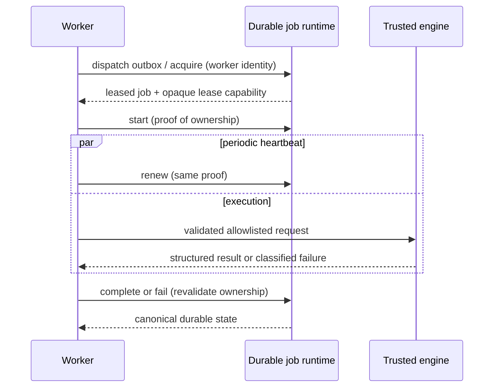

# Trusted Scientific Job Worker (Phase 2C.2B)

Phase 2C.2B is the trusted execution plane for Phase 2C.2A `ScientificJob` records. It executes only durable jobs that have already been created by the campaign/job runtime. It does not generate hypotheses, select models, plan experiments, assess scientific truth, decide the next campaign action, or stop a campaign.


The worker is stateless apart from transient task handles, opaque lease capabilities, metrics, and a redacted local health record. `ScientificJobRuntime` remains authoritative for jobs, leases, outbox state, retries, results, attachment state, and audit events. The worker never uses a process-memory queue as the source of truth.

## Worker identity and authentication

Every worker has an opaque `worker_id`, worker/runtime versions, process start time, supported engine/version list, resource classes, configured capacity, and safe health counters. It never publishes a hostname, username, filesystem path, raw environment, credential, lease token, or network topology.

The worker process requires a dedicated bootstrap credential:

- `MYSTIC_SCIENTIFIC_WORKER_CREDENTIAL_HASHES`: one or more SHA-256 verifier digests, comma-separated for rotation;
- `MYSTIC_SCIENTIFIC_WORKER_CREDENTIAL`: the worker process's supplied credential;
- `MYSTIC_SCIENTIFIC_WORKER_ID`: optional opaque identifier; otherwise a fresh per-process identifier is generated.

Verification uses constant-time digest comparison. Multiple digests allow rotation; removing a digest revokes it. These values are distinct from MCP OAuth, Control Center, runner-fleet, provider, and Supabase credentials. Worker mutation operations are not MCP tools.

## Polling, capacity, and leases

`MYSTIC_SCIENTIFIC_WORKER_CONCURRENCY` defaults to `1` and is bounded to `32`. The service dispatches/reconciles a bounded durable batch, atomically acquires at most its available capacity, and gives exactly one transient task ownership of each acquired lease. A task failure cannot stop unrelated tasks.

Idle polling starts at one second, uses deterministic bounded jitter and exponential backoff, and never exceeds 30 seconds. When capacity exists and work is acquired, the backoff resets. It does not busy-loop.



Heartbeats begin after start and run no later than half the lease TTL. A renewal failure makes the local execution non-committable. The worker stops cooperatively when it loses ownership and never completes "anyway". The durable reconciler reclaims the abandoned job under the retry policy.

## Engine boundary and cancellation

The worker uses the existing `ScientificJobRequest`, `ScientificJobExecution`, `ScientificJobResult`, `ScientificJobFailure`, and `ScientificEngineJobAdapter`. The adapter validates the job type, engine allowlist, exact engine version, canonical input payload, result schema/size, and result hash. Built-in trusted engines execute in-process only; this is not a hardened sandbox.

No worker path permits `eval`, `exec`, `shell=True`, dynamic imports/dependencies, arbitrary user modules, arbitrary paths, or unrestricted network access. Future subprocess engines require explicit argv, bounded temporary storage/environment/output, timeout/process-group termination, and cleanup.

The cancellation check runs before and during execution via the heartbeat path. If cancellation wins the durable race, the worker does not attach success. Engines may be cooperative only; a non-interruptible built-in engine can finish physical computation, but the durable runtime rejects a late logical success after authoritative cancellation.

## Failure taxonomy and recovery

| Category | Examples | Default retry |
| --- | --- | --- |
| Scientific/input | invalid input, incompatible version, deterministic model/solver boundary | no |
| Infrastructure | temporary backend outage, worker interruption, temporary resource shortage | yes |
| Execution | timeout, bounded engine crash | policy/classification dependent |
| Policy/safety | prohibited operation, resource/output limit, unsupported class | no |

Persisted failure data is bounded to category, stable safe code, diagnostic ID, retryability, attempt, and next-ready time. Raw stack traces are not public records. The durable job runtime enforces `max_attempts`, deterministic retry delay, and terminal `DEAD_LETTER`; the worker cannot override those bounds.

On startup and periodically, the worker runs the existing bounded idempotent reconciler. It repairs expired leases, stale outbox dispatch, retry-ready jobs, pending result/failure attachment, cancellation acknowledgement, and duplicate/replayed attachment state. Concurrent reconciliation remains safe because the durable runtime is compare-and-swap/idempotency protected.

Physical execution is at-least-once under a crash boundary. Mystic does **not** claim exactly-once physical engine execution. A successful result is accepted once under its durable result identity and campaign application is logically exactly once through the Phase 2C.2A attachment key.

## CLI and safe status

```bash
uv run python -m mystic.lab.worker --self-test
uv run python -m mystic.lab.worker --once
uv run python -m mystic.lab.worker --run
uv run python -m mystic.lab.worker --status
uv run python -m mystic.lab.worker --reconcile-once
uv run python -m mystic.lab.worker --drain
```

`--once` consumes a persisted job through the real durable path; it accepts no local arbitrary engine/payload bypass. All modes other than `--self-test` require the dedicated worker credential. Output is safe JSON and never prints a credential or lease capability.

`--status` and `--drain` target the running opaque worker ID and require `MYSTIC_SCIENTIFIC_WORKER_ID`. `--drain` writes a credential-protected local drain intent; the running service observes it before acquiring another job, then performs its bounded graceful drain. It never cancels or rewrites durable jobs directly.

Workers write only a fixed-schema redacted status record under `mystic_data/scientific_workers/`. The record is monitoring data, not job authority. Local MCP exposes read-only `lab_worker_list` and `lab_worker_get` for the Control Center `/workers` view. There are intentionally no MCP worker acquire, heartbeat, start, execute, complete, fail, drain, or reconcile-mutation tools.

## Future hooks

The service emits observer-only hooks for `job_succeeded`, `job_failed`, `job_cancelled`, `job_dead_lettered`, `result_attached`, and `evidence_available`. Observer failures cannot roll back durable state. Future Phase 2C.3 policy/orchestration may consume these events; it must still create work through the campaign/job runtime rather than direct worker control.
